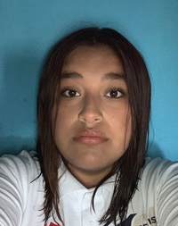

# Documentacion de aplicacion 
Proyecto final del semestre Agosto-diciembre del equipo los midudev 

- Objetivo
- Integrante
- Analilis de la base de datos

  ## Objetivo
  * Realizar una aplicacion sobre la nutricion en los alimnetos

  ### integrantes
#### Datos Generales 
*Integrante Uno
##### Informacion personal
- Nombre completo:  [Medina Patlan Marisol]
- Correo eletronico: [23308060610240@cetis61.edu.mx]
- Especialidad:  [Programacion]
- Institucion: [CETis61]
- 

*Integrante dos
##### Informacion personal
- Nombre completo:  [Muñoz Torres Jose Miguel]
- Correo eletronico:  [233080610631@cetis61.edu.mx]
- Especialidad:  [Programacion]
- Institucion:  [CETis61]
- 

# Introducción

Hoy en día existen muchas aplicaciones móviles que ayudan a las personas a cuidar su alimentación y mejorar sus hábitos de salud. La tecnología ha permitido que llevar un registro de lo que comemos sea más fácil y rápido. Esta investigación busca conocer cuáles son algunas de las apps más usadas para la nutrición, entendiendo sus funciones principales y cómo pueden apoyar una vida más saludable. A partir de esta información se pueden identificar sus ventajas, limitaciones y el tipo de usuario al que están dirigidas.

